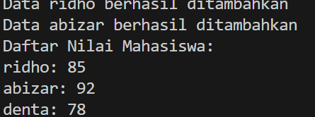
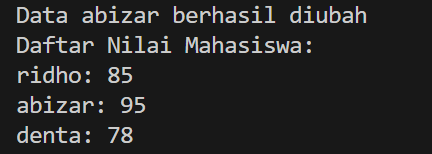
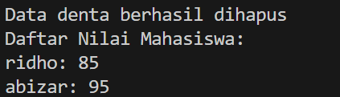
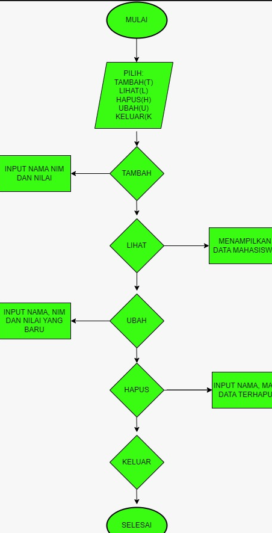

# Menampilkan data
daftar_nilai_mahasiswa.tampilkan()

# Mengubah data
daftar_nilai_mahasiswa.ubah("abizar", 95)
daftar_nilai_mahasiswa.tampilkan()

# Menghapus data
daftar_nilai_mahasiswa.hapus("denta")
daftar_nilai_mahasiswa.tampilkan()

# flowchart

